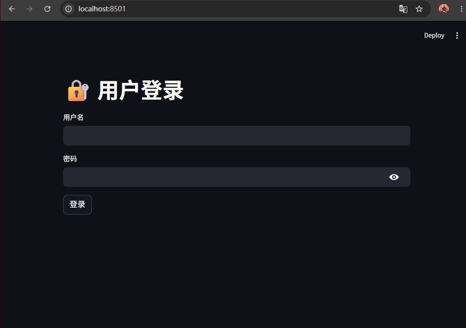
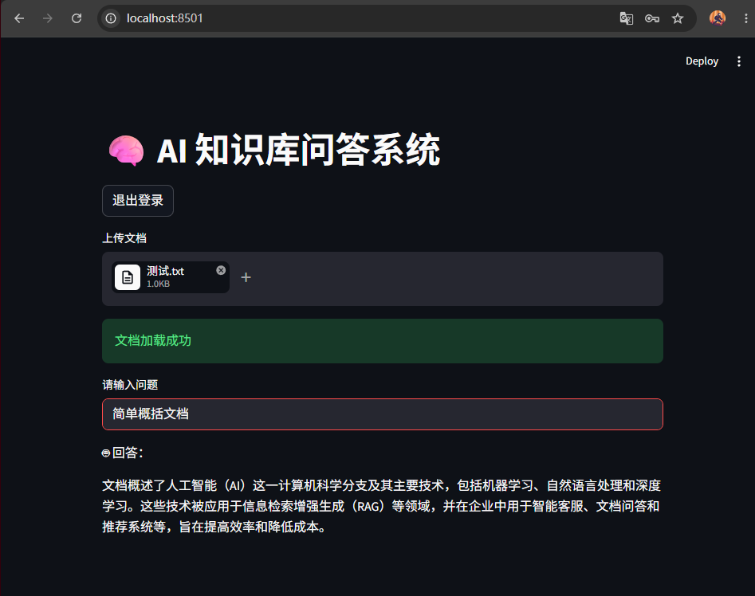

# 🧠 AI Knowledge Base QA System (RAG + GLM)
## 📌 项目简介
本项目是一个基于 **Python + 智谱 GLM 大模型 API** 构建的 AI 知识库问答系统。
系统支持用户上传文档，并基于文档内容进行智能问答，采用 **RAG（Retrieval-Augmented Generation）架构** 提升回答准确性。
👉 项目模拟企业知识库应用场景，如：文档问答、智能客服等。
---
## 🚀 功能特性
* 📄 支持多格式文档解析（PDF / TXT）
* 🔍 文本分块 + 检索机制（RAG）
* 🤖 基于大模型的上下文问答
* 🌐 Web界面（Streamlit）
* 🔐 用户登录系统（Session管理）
* ⚡ 简单易扩展，可接入向量数据库（FAISS）
---
## 🛠 技术栈
* **后端**：Python
* **前端**：Streamlit
* **大模型**：智谱 GLM（ZhipuAI）
* **文档解析**：PyPDF2
* **环境管理**：python-dotenv
---
## 📂 项目结构
```
glm-qa-system/
│
├── app.py                # Web入口（Streamlit）
├── config.py             # 配置文件
├── requirements.txt
├── .env                  # API Key（已忽略上传）
│
├── core/
│   ├── llm.py            # 大模型调用封装
│   ├── parser.py         # 文档解析
│   ├── rag.py            # RAG逻辑
│   └── retriever.py      # 文本检索
│
└── data/                 # 测试数据
```
---
## ⚙️ 环境配置
### 1️⃣ 安装依赖
```bash
pip install -r requirements.txt
```
### 2️⃣ 配置 API Key
在项目根目录创建 `.env` 文件：
```bash
ZHIPU_API_KEY=your_api_key_here
```
---
## ▶️ 运行项目
```bash
streamlit run app.py
```
浏览器访问：
```
http://localhost:8501
```
---


## 🧠 核心实现

### 🔹 RAG（检索增强生成）

项目通过以下流程实现：
1. 文档解析 → 提取文本
2. 文本分块（chunk）
3. 检索相关内容（Top-K）
4. 拼接上下文
5. 输入大模型生成回答
👉 相比直接调用 LLM，显著提升回答准确性与可控性。
---
### 🔹 大模型封装
* 封装 GLM API 调用逻辑
* 支持多轮消息格式（messages）
* 增加异常处理与调试输出
---
## 📈 项目亮点
* ✅ 实现完整 RAG 架构（检索 + 生成）
* ✅ 支持真实文档问答场景
* ✅ 模块化设计（易扩展）
* ✅ 集成 Web 界面（可交互）
* ✅ 具备实际工程结构（非 demo）
---
## 🚀 可扩展方向
* 🔥 接入向量数据库（FAISS / Milvus）
* 🔥 多文档知识库管理
* 🔥 聊天历史记忆（Conversation Memory）
* 🔥 用户系统（数据库 + 权限）
* 🔥 部署（Docker / 云服务）
---
## 👨‍💻 作者：童登博
* GitHub: https://github.com/Xiaowangzbc
---
## 📄 License
MIT License
